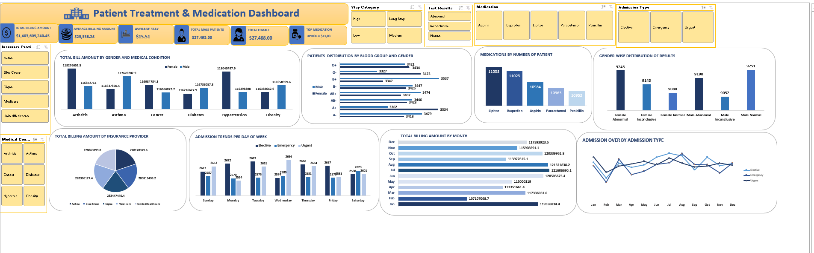

# 🏥 Patient Treatment Dashboard

A healthcare analytics dashboard built in Excel showing patient admissions, treatment summaries, and billing trends.

**Key Highlights**:

- KPI cards: Total Billing Amount, Average Billing Amount, Average Stay Duration, Total Male & Female Patients, and Top Medication
- Billing analysis: By Gender, Medical Condition, and Insurance Provider
- Patient insights: Gender and Blood Group distribution
- Admission trends: By Day of the Week and Month
- Medication analysis: Number of Patients by Medication Type
- Interactive slicers: Stay Category, Test Results, Medication, Admission Type, Medical Condition, and Insurance Provider

Tools Used:
Excel | Pivot Tables | Charts | Data Cleaning | Conditional Formatting | Slicers

Key Insights:
-The hospital shows steady financial performance, with billing peaking in August (~12.13M) and averaging 11–12M monthly.

-Mid-year months (July–August) record higher patient activity, while February sees a dip.

-Insurance billing is well-balanced across Medicare, Blue Cross, and UnitedHealthcare (~28M each), minimizing risk.

-Females drive higher costs for Arthritis, Cancer, and Hypertension, while Males lead in Asthma, Diabetes, and Obesity, showing overall balanced utilization.

-Hypertension and Arthritis generate the highest revenue, indicating key chronic condition impacts.

-Further insights on admissions by weekday can enhance resource planning.
