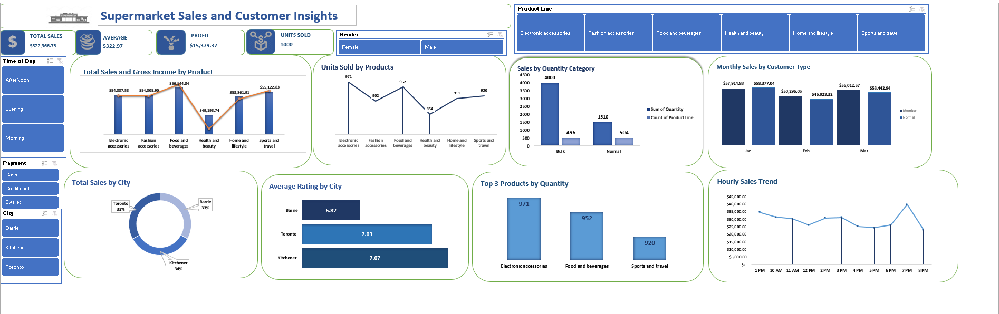

🛒 Supermarket Sales Dashboard

This Excel dashboard analyzes supermarket sales performance across multiple cities, highlighting sales, profit, and customer insights.

**Key Highlights:**
- KPI cards: Total, Average, Maximum & Minimum Sales, and Units Sold  
- Sales analysis by City, Product Line 
- Time-based analysis: Hourly and Monthly sales breakdown  
- Top 3 Product Lines by Quantity Sold  
- Interactive slicers: Gender, City, Customer Type, and Product Line

  
**Tools Used:**  
Excel | Pivot Tables | Charts | Data Cleaning | Conditional Formatting | Slicers

